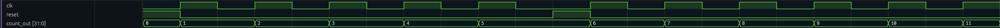

The counter does not reset after the first for because on the rising edge of the clock the reset is down. 

To exploit reset, we should modify the code as follows:

```cpp
reset = true;
sc_start(1, SC_NS);
clk = true;
sc_start(1, SC_NS);
reset = false; // Release reset
clk = false;
```

As you can see, compared to the original version, the line `reset = false;` is removed. By doing this, the output waves are the following:

